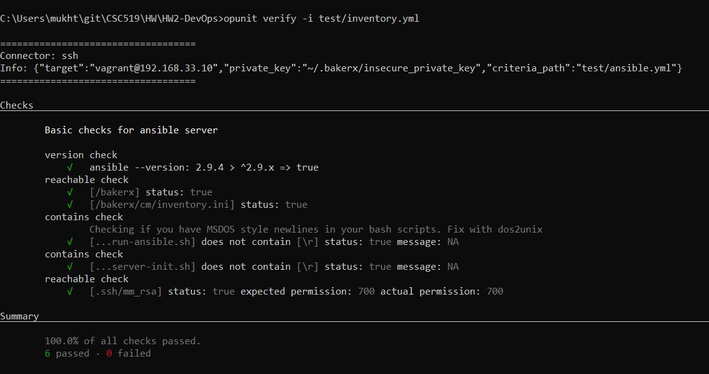
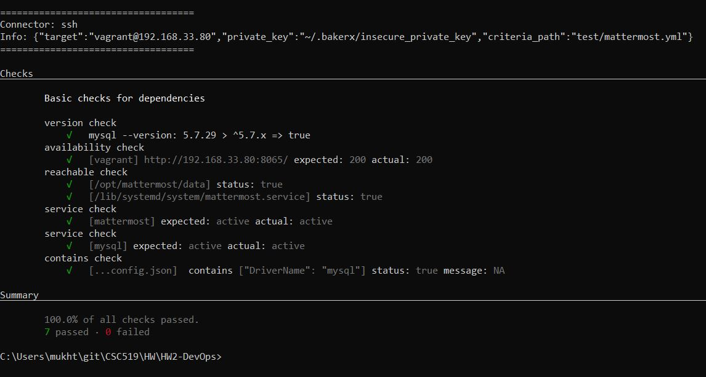
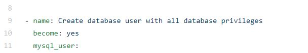

# HW2-DevOps

NC State University: CSC 519 - DevOps

#### HW2 - Configuration Management

## Requirements

- Use ansible to install, configure, and run mattermost on a VM using this [installation guide](https://docs.mattermost.com/install/install-ubuntu-1804.html)
- Create a team, users and then post a message
- Full Requirements: https://github.com/CSC-DevOps/Course/blob/master/HW/HW2-mm.md
- [PDF](HW2_requirements.pdf)

## How to run

- Install/Update opunit with `npm install opunit -g`
- Install/Update bakerx with `npm install ottomatica/bakerx -g`
- run `npm install`
- run `npm link`
- run `cm setup`
    - if you are getting an bad interpreter error for any of the scripts, you need to change convert the scripts to UNIX
    - use the command `dos2unix run-ansible.sh` and `dos2unix server-init.sh`
    - On Windows, run `git config --global core.autocrlf true` to avoid newline issues
- run `cm playbook cm/playbook.yml cm/inventory.ini`
- Go to http://192.168.33.80:8065 to use mattermost

## Ansible Galaxy Roles Used

- used ansible galaxy role to install mysql
    - Link: https://galaxy.ansible.com/geerlingguy/mysql

## Third Party Libraries Used

- used library called json_patch to edit json files
    - Link: https://github.com/particledecay/ansible-jsonpatch

## Opunit Check

I ran `opunit verify -i test/inventory.yml`. The results can be seen below

## Screencast

Link: https://www.youtube.com/watch?v=odVUPM_5w3U

** After uploading the screencast, I realized I showed the username and password for the creation of a db user for mysql in the description for that step. I updated the code to not have it in the description. The change can be seen on line 9 in cm/roles/mysql/tasks/main.yml

## Extra Credit

None
