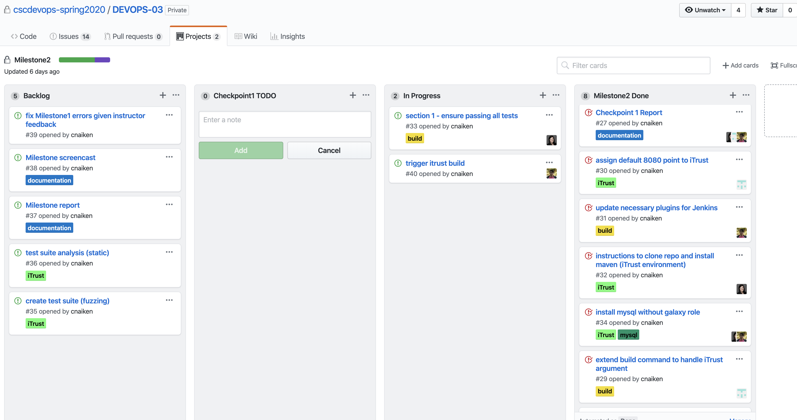

# MILESTONE 1 | CHECKPOINT 1

## Work Accomplished:
- Completed the first section of the Build Component _Automatically Configure a Jenkins Server_
  * Established code structure for scripts and ansible playbook.
  * Implemented scripts to povision and configure a jenkins server.
  * Constructed playbook and roles to configure the jenkins server and install necessary dependencies.
- The screenshot below shows our current project board used to plan organize tasks for this checkpoint and backlog of tasks to be completed throughout the project.

Through the project board we have actively planned next steps and equally divided work.

## Work to be Done:
- In the next checkpoint we will work to complete the second section of the Build Component _Automatically Configure a Build Environment_. Currently we have created large tasks that need to be split into more specific subtasks. The following are goals that have already been established.
  * Create a build job (need for further division and subtasks).
  * Install additional dependencies such as node.js on the jenkins server.
  * Install checkbox.io dependencies necessary for further build component sections.
  
## [Screencast](https://drive.google.com/file/d/1n3AdVe-CutzvwEt9ePp6V8mVIV3T2fzV/view?usp=sharing):
- The screencast is a simple video recording to display running our current scripts run by the following commands
```Bash
pipeline setup
pipeline playbook pipeline/playbook.yml pipeline/inventory.ini
```
______
# MILESTONE 1 | CHECKPOINT 2

## Work Accomplished:
- Completed the second section of the Build Component _Automatically Configure a Build Environment_
  * Installed dependencies - MongoDB, NGINX, NPM, and others.
  * Established necessary environment variables.
  * Configure MONGO with necessary user and databases
  * Did research in ansible vault to protect high security variables.
  * Began work on devising the Jenkins Build file to pass to Ansible
- The screenshot below shows our current project board used to plan organize tasks for this checkpoint and backlog of tasks to be completed throughout the project.


Through the project board we have actively planned next steps and equally divided work.

## Work to be Done:
- In the next checkpoint we will work to complete the third section of the Build Component _Create a Build Job_. Currently we have broken up previously large tasks into smaller components. More will be devised as we continue to work through the Milestone. The following are goals that have already been established.
  * Create a build job file and process with ansible model jenkins-job.
  * Apply ansible vault to protect high security variables like user names and passwords.
  * Launch build job and test for test for success
  * Launch checkboxio server and test for success.
  
## Running the Code
- Run current accomplished work by running the following.
```Bash
pipeline setup
```

___________________

# MILESTONE 2 | CHECKPOINT 1

## Work Accomplished:
- Completed the second section of the Test Component _Automatically configure a build environment and build job (iTrust)_
  * Established necessary Milestone commands and accompanying arguments
  * Created the build environment for iTrust
   - Manually installed MYSQL on the jenkins server
   - udpated iTrust application with appropriate instance configurations for both email and db
  * Created iTrust build job for Jenkins
- Begun looking into running iTrust automated tests individually to monitor test usefulness

## Work to be Done:
- In the next checkpoint we will work to complete the second and thirst sections of the Test Component _Implement a test suite analysis for detecting useful tests_ and _Implement a static analysis for checkbox.io_. Currently we have broken up previously large tasks into smaller components. More will be devised as we continue to work through the Milestone. The following are goals that have already been established.
  * Finalize build script to trigger Jenkins build job
  * Clean up & extract dynamic variables
  * Establish Fuzzing test suite
  * Establish static analysis suite
  * Create Milestone screencast
  * Extend documentation to include Milestone 2 specifics
 
 ## Running the Code
- Run current accomplished work by running the following.
```Bash
pipeline setup --gh-user <github username> --gh-pass <github password> # to set up the jenkins and iTrust server
```
 ## Current Milestone [Project Board](https://github.ncsu.edu/cscdevops-spring2020/DEVOPS-03/projects/2)
 

___________________

# MILESTONE 3 | CHECKPOINT 1

## Work Accomplished:
- Completed the basic functionality of the pipeline canary command
  * Build VMs with the provided branches as arguments
  * Implemented continued stress loading of blue and green servers
  * Collect metrics data pinging between VMs
  * Aggregate data with traffic server
- Created template commands for cloud VM interaction
- Provisioned cloud servers in preparation for checkbox and iTrust deployment

## Work to be Done:
- In the next checkpoint we will work to complete the functionality for allocating virtual compute instances through Digital Ocean on which to build checkpoint.io and iTrust. We will also continue work on analyzing metric statistics and evaluating canary scores.

 ## Running the Code
- Run current accomplished work by running the following:
```Bash
pipeline canary master broken # shows current progress in analyzing blue/green servers health metrics.
```
 ## Current Milestone [Project Board](https://github.ncsu.edu/cscdevops-spring2020/DEVOPS-03/projects/3)
 
