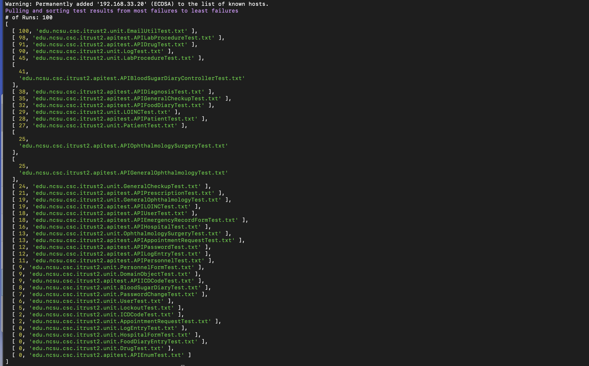

# DEVOPS-03
### This repository is dedicated to fulfilling the requirements set forth by CSC 519- DEVOPS for Spring 2020 Course Project
________

# How to Run
```Bash
git clone https://github.ncsu.edu/cscdevops-spring2020/DEVOPS-03.git
cd /DEVOPS-03
npm install
```
```Bash
# (Windows Users) recommended transformations ------
 dos2unix pipeline/server-init.sh
 dos2unix pipeline/run-jenkins.sh
 # This will ensure the scripts run on a unix VM ---
```
```Bash
# Configure jenkins, build environments, build jobs
# --gh-user and --gh-pass should be used for accessing iTrust repo on github.ncsu.edu
$ pipeline setup --gh-user <username> --gh-pass <password>

# Trigger a build job (named iTrust), wait for output, and print build log.
$ pipeline build iTrust

# Initiate analysis of test suite for iTrust to run `-c` numbers of times.
# Output list of tests, ordered from most useful to least useful, based on the number of times 
# the test has detected a failed build.
$ pipeline useful-tests -c 100
90/100 edu.ncsu.csc.itrust.unit.action.GenerateCalendarActionTest.testGetApptsTable
80/100 edu.ncsu.csc.itrust.unit.report.DemographicReportFilterTest.testToString
70/100 edu.ncsu.csc.itrust.unit.action.AddPatientFileActionTest.testRequiredFieldMissing
10/100 edu.ncsu.csc.itrust.unit.model.officeVisit.OfficeVisitValidatorTest.testSetInvalidHospital
...

# Trigger a build job (named checkbox.io), wait for output, and print build log. 
# Static analysis should fail build job if any code smells are detected.
$ pipeline build checkbox.io

# Trigger a build job (named itrust_war). 
# Builds iTrust application and packages war file for deployment on server.
$ pipeline build itrust_war <gh_user> <gh_pass>

# Trigger the provisioning of cloud instances
# see section 'Additional Information' for necessary environment variables
$ pipeline prod up

# Perform a deployment of checkbox.io with given inventory
# Path to inventory file must be relative to root directory of repository
$ pipeline deploy checkbox.io -i <inventory.ini>

# Perform a deployment of iTrust with given inventory
# Path to inventory file must be relative to root directory of repository
$ pipeline deploy iTrust -i <inventory.ini>

# Construct canary infrastructure, collect data, and perform analysis on the given branches.
$ pipeline canary <Blue branch> <Green branch>
```
_________

# Checkpoint Reports

- [CHECKPOINT REPORT](CHECKPOINT.md) 

____

# Milestone 1 Report

### What we accomplished

-  _Automatically Configured a Jenkins Server_
   * Established code structure for scripts and ansible playbook.
   * Implemented scripts to provision and configure a jenkins server.
   * Constructed playbook and roles to configure the jenkins server and install necessary dependencies.
   * Used ansible vault to protect sensitive data
  
- _Automatically configured a build environment_
  * Installed dependencies - MongoDB, NGINX, NPM, PIP
  * Established necessary environment variables.
  * Configured MONGO with necessary user and databases
  * Installed necessary dependencies for Jenkins Job Builder
  * All this done with ansible playbook
  
- _Created and Built a Jenkins Job_
  * Created a .ini file for jenkins job builder
  * Created a YAML file that contained configuration for the jenkins job
  * Created a .js file to trigger the build
  * Tore down services for the jenkins job to have idempotency

### What we learned

- How to use ansible vault
  - how to encrypt/decrypt data
  - how to use a password file to decrypt data to run ansible playbook
- How to use Jenkins:
  - the web application
  - creating yaml configuration file for a jenkins job
  - creating .ini files for jenkins job builder
  - automatically installing jenkisn plugins using ansible
  - using jenkins job builder to create jobs automatically
  - trigger build jobs automatically using the jenkins npm package
  - stream the build output from jenkins to our terminal using jenkins package

### Issues we ran into
- Differences in system requirements:
  - Windows v/s Mac:
    - affected implementation of ansible vault
    - affected formatting of .txt files: as various members were creating and pushing to the repo, care was taken to ensure that everything was compatible for both windows and linux based systems
    - Although this was problematic at times, it proved a useful check that code work cross platforms.
- Correct installation of modules:
  - Specifically jenkins-job-builder. The suggested pip install did not include all the necessary dependencies to accurately post a new build job to jenkins. After much research, we decided to install directly from the repository to account for all tthe necessary requirements.
- Permissions & Access:
  - Understanding and implementing ansible vaulting and ensuring security of private variables took much time to undertand.
  - Applying the appropriate permissions in the mongo database to allow for jenkins user access. We ran into an issue here during creation of users and the permissions/databases they were associated with.
___

# Milestone 2 Report

### What we accomplished

- _Automatically configured a build environment for iTrust_
  * Created an ansible playbook role to configure server for iTrust
  * Installed dependencies - MySQL, Maven, Google Chrome
  * Established necessary credentials to clone iTrust
  
- _Created and Built an iTrust Build Job_
  * Created a .ini file for jenkins job builder
  * Created a YAML file that contained configuration for the jenkins job
  * Added to our build.js file to build the job
  * Tore down services for the jenkins job to have idempotency

- _Created Fuzzing file
  * Created file that fuzzed up to 10% of source code for iTrust
  * It would replace '==', '!=', '>=', '<=', '||', and/or '&&' randomly for each file chosen

- _Created test results prioritization file
  * Created command to take input of how many times a user wants the iTrust test suite to run
  * Created files that would order tests from most useful to least useful based on failures after they were fuzzed
  * Printed the tests for the user
  
- _Created static analysis file for checkbox.io_
  * Created an analysis file that detected:
    * long methods with > 100 loc
    * detect message chains with > 10 chains (chain uses a .)
    * max nesting depths for if statements where the depth was > 5 statements
  * We used esprima to accomplish this

### What we learned

- How to pass github username and password from command line to jenkins build job to clone iTrust
- How to fuzz source files
- How to prioritize test results when the source code is mutated
- How to do a static analysis of code based on certain parameters

### Issues we ran into
- Test Suite timeout messages
  - the iTrust testsuite would have timeout messages in each run. This would significantly increase our testing time because we had to wait very long on each run.
  - The TA allowed us to run the command `mvn clean test` which only runs unit tests for the testsuite which saved us time
- Fuzzing Files
  - We spent a lot of time deciding what mutations to introduce to the code. We spend a lot of time doing trial and error to figure out which ones will work and not cause compilation errors. 
  - We fine tuned the percentage chance of the different fuzzing choices to change the files which took time.
  - We also spent time trying to cap the amount of files being fuzzed to no more than 10%. It took a while for us to come up with the best way to do this based on how we learned in class.
- iTrust properties file credentials
  - Had to figure out how to send the mysql root credentials and email credentials to the property files in iTrust
- Setting github username and password as environment variables
  - Had trouble setting the github credentials as environment variables so the the useful-tests command can clone iTrust. We tried to set them in the run-jenkins script but it didn't work.
    - In the end, we had to do it in the playbook
  - Had trouble on Mac OS specifically. The environment variables were not being recognized when cloning the repo in the useful-test.js file
- Timezone setting for VM
  - This caused us to spend too much time on the build configuration for iTrust.
  - We were getting test failures and didn't know why until it was recommended for us to set the timezone. This fixed the failures
- Memory for VM
  - We had unexpected test failures until we increased the VM memory
- Cross-platform shell commands
  - We had an issue specifically with how quotes (single verses double) were interpretted by the host OS.
  - Positioning of quotes also affect the timing of variable assignment, if populated by the host machine or passed to the jenkins server for assignment.
  
___
# Build Output
```Bash
$ pipeline build iTrust
...
...
#### END OF BUILD OUTPUT ####
```
- Successful execution should terminate with a status of _Build Successful_.

Scrolling up through the output will reveal both UNIT and INTEGRATION test outcomes.

```Bash
$ pipeline build checkbox.io
...
...
#### END OF BUILD OUTPUT ####
```
- Successful execution should terminate with a status of _Build Successful_.

- Build Failures could occur if static analysis checks are not passed.
  * Case 1: Long Method detected --> longer than 100 lines of code
  * Case 2: Long message chain detected --> longer than 10 chains
  * Case 3: Deep nesting depth --> deeper than 5
 
 _If failure occurs do to any of the cases above, the remainder of the build will fail as the program will exit with a non-zero return status. Evidence of failure can be found in the build output report._
 
 # Fuzzing with 100 runs
 
 Below is an image of us running `pipeline useful-tests -c 100`. We didn't have this run in our screencast because it took a few hours to complete, but we wanted to include it here to show our command can handle 100 runs. In the image below you can see that the run was successful and we ordered the failure of tests correctly. 
 
 
 
 ___

# Milestone 3 Report

### What we accomplished

- Monitoring Dashboard:
  - Provisioned three cloud instances through Digital Ocean, instituting a monitoring dashboard to take in and display measurements of registered applications.
  - Automated deployment of web applications iTrust and Checkbox.io using Apache Tomcat and NGINX
- Canary Analysis:
  - Constructed a local computing environment with three VMs (Blue, Green, & Traffic). Blue and Green VMs representing deployment instances of a service while the traffic VM handled monitoring and load.
  - Spawned a series of requests to stress servers for an extended period of time.
  - Gathered metrics and applied these metrics to create an automated analysis between instances.

### What we learned
- How to provision cloud instances through a cloud provider using api calls.
- How to automate deployment of services through ansible scripting modules.
- General structure and implementation of server tools such as Redis, Apache Tomcat, and NGINX
- Theory and application of Canary analysis as it pertains to the evaluation of service instances.
- How to construct server communication via servers and their configurations.

### Issues we ran into
- NGINX configuration, what variables to be set and how to update necessary attributes for a particular server.
- REDIS configuration of server not open to incoming requests, remedied by opening communication
- TOMCAT deployment of war file (1) required sizing and (2) not understanding how war files were packaged led to an issue with missing database components. The SQL data had to be migrated to the server and ingested into the local server.
- FOREVER inconsistant initialization of running processes. This was a product of the cloud environment configuration.
- CANARY ANALYSIS understanding the expectation of comparison between servers. Was suggested to use package 'mann-whitney-utest' for computer canary scores. Canary scores proved mostly consistent for all instance combinations. There were some times where the memory usage of the vms would show very different returns and contribute to the failing of duplicate branch instances. Although these failures were few, we believe that these failures were contributed to by the stress on the local machine during the execution of the test.
- MONITOR we struggled receiving and sending communication from the cloud monitor and agents. This was a result of malformed environment configurations.
- General timing of Javascript commands due to the asychronous nature of the language. 
  
___
# Additional Information
- Monitoring Dashboard: latency measurements have a 10 second delay before dashboard is populated
- Cloud Instance Provisioning: the following environment variables must be set when provisioning server instances via Digital Ocean
  - DIGITAL_OCEAN_SSH_KEY: hash to digital ocean public key
  - CSC519_PROJECT_M3: digital ocean api token
  - it is also necessary to copy the private key used to created the instance into the jenkins ansible server under
```Bash
 ~/.ssh/m3_rsa
```

____
# [Milestone 1 Screencast](https://drive.google.com/file/d/1BhY7vZ0D5vUngzLl5-FWycn0q8Hk-EKR/view?usp=sharing)

# [Milestone 2 Screencast](https://drive.google.com/file/d/16T3NyF5lrX-5u68Kp4Puus0KtBRd5rXG/view?usp=sharing)

# [Milestone 3 Screencast](https://drive.google.com/file/d/15GF-bKRF2q53oH0g_DeUmqbX1DqH1q3W/view?usp=sharing)
